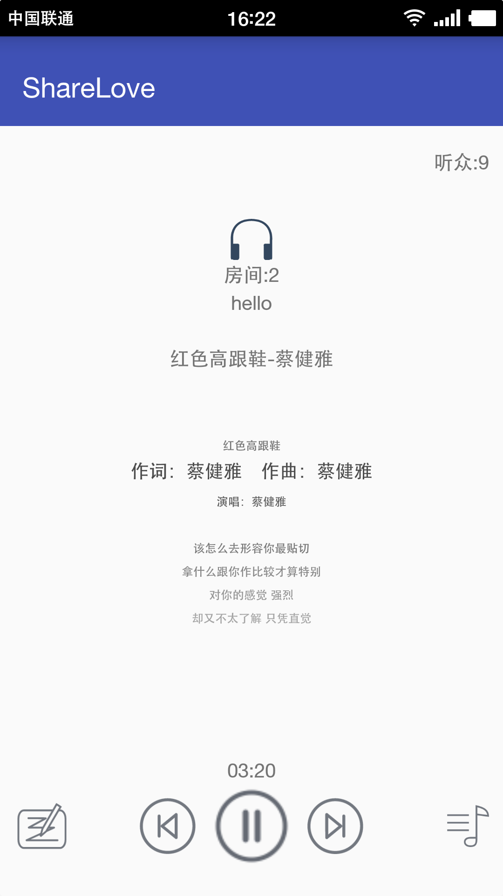

# 一款基于安卓开发的音乐同步直播App——ShareLove

功能：
	* 分享当前你的直播间所播放的音乐

# CastVideos-android (reference Android sender app)

CastVideos-android application shows how to cast videos from an android device in a way that is fully compliant with the Design Checklist

**This is a reference sender app to be used as the starting point for your Android sender app**

Here is the list of other reference apps:

* [Receiver: Cast-Player-Sample](https://github.com/googlecast/Cast-Player-Sample)
